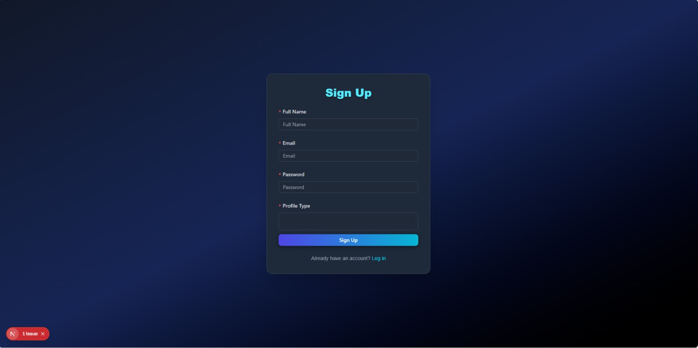
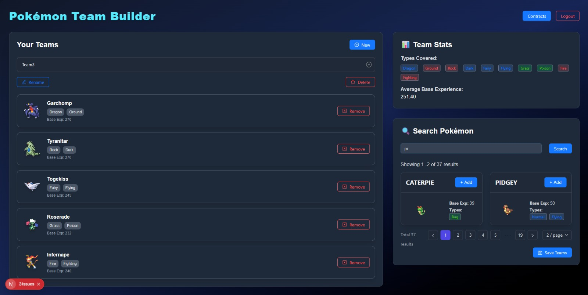
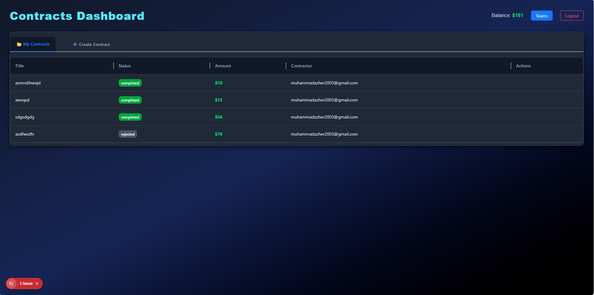

# Pokémon Team Assignment

A full-stack web application that allows users to **search, view, and manage Pokémon teams**.  
Built with **Next.js (frontend)**, **Express.js (backend)**, **MongoDB (database)**, and **JWT-based authentication**.

---

## 🚀 Features

- 🔍 Search Pokémon by name (exact and partial matches)
- 📑 Pagination support for large search results
- 📊 Pokémon details with image, types, and base experience
- 🧑‍🤝‍🧑 User authentication (Sign up, Login)
- 🛡️ JWT-based authentication for secure API requests
- 📂 Team management (add/remove Pokémon from your team)
- 🎨 Dark mode UI with TailwindCSS + Ant Design components

---

## 🛠️ Tech Stack

- **Frontend:** Next.js, React, TailwindCSS, Ant Design  
- **Backend:** Node.js, Express.js  
- **Database:** MongoDB (Mongoose ODM)  
- **Authentication:** JWT (JSON Web Token)  

---

## ⚙️ Installation & Setup

### 1️⃣ Clone Repository
```bash
git clone https://github.com/your-username/pokemon-team-assignment.git
cd pokemon-team-assignment
```

### 2️⃣ Install Dependencies

For both frontend and backend:
```bash
npm install
```

### 3️⃣ Setup Environment Variables

Create a .env.local file in the root directory and add:
```bash
MONGO_URI=your-mongodb-connection-uri
JWT_SECRET=your-secret-key
PORT=5000
```

MONGO_URI: Your MongoDB Atlas/local connection string

JWT_SECRET: A random secret string for JWT signing

PORT: Port for your Express backend (default: 5000)

### 4️⃣ Run the Development Servers
Backend (Express API)
```bash
cd backend
npm run dev
```

Frontend (Next.js)
```bash
cd frontend
npm run dev
```


Now open http://localhost:3000
 🚀

### 📸 Screenshots

Add screenshots here once UI is ready. Example:
### Sign Up Page


### Teams Page


### Contracts Page



### 📌 Folder Structure
```
pokemon-team-assignment/
│── backend/        # Express.js backend
│   ├── models/     # Mongoose models
│   ├── routes/     # Express routes
│   └── server.js   # Entry point
│
│── frontend/       # Next.js frontend
│   ├── app/        # Pages & components
│   └── styles/     # TailwindCSS styles
│
│── .env.local      # Environment variables
│── package.json
│── README.md
```

### 🤝 Contributing

Pull requests are welcome! For major changes, open an issue first to discuss what you’d like to change.

### 📜 License

This project is licensed under the MIT License.
